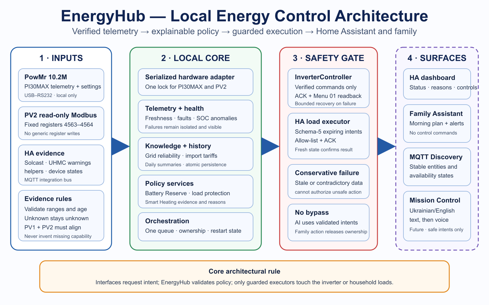
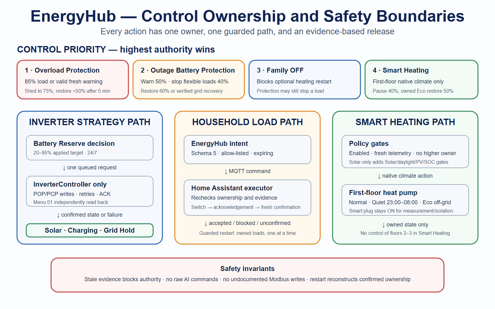
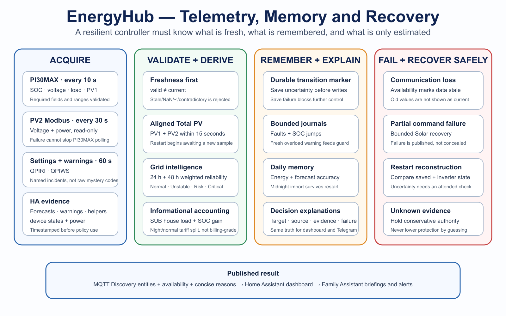

# EnergyHub System Architecture

## Overview

EnergyHub connects the physical energy system, Home Assistant, MQTT, decision services, and persistent state.







These infographics are the version-neutral visual specification. Together with
the [current reserve contract](BATTERY_RESERVE_CURRENT.md) and
[Developer Architecture](10-Developer-Architecture.md), they show the physical
inputs, local core, safety boundary, control ownership, failure behavior, and
extension boundary needed to recreate the design.

## External systems

### PowMr 10.2M inverter

- local USB-RS232;
- PI30MAX protocol;
- `mpp-solar` command-line adapter;
- default telemetry poll every 10 seconds;
- QPIWS and QPIRI reads every 60 seconds;
- optional read-only Modbus RTU PV2 polling at a default 30-second interval;
- one adapter-owned serial lock prevents any overlap between `mpp-solar` and direct Modbus access.

### Home Assistant

- owns the user experience, schedules, helpers, scripts, notifications, and selected household automations;
- publishes control and forecast inputs through MQTT;
- consumes EnergyHub MQTT Discovery and state.

### Mosquitto MQTT

MQTT is the integration bus between EnergyHub and Home Assistant.

### Solcast

Home Assistant publishes live Today and Tomorrow forecasts to EnergyHub. Scheduled daily values are also included in the atomic Daily Summary snapshot.

## Core layers

### 1. Adapter layer

`app/adapters/powmr.py` converts local serial execution into five bounded adapter operations:

- read telemetry;
- read warnings;
- read settings;
- read the fixed PV2 holding-register pair;
- write output/charger source priority.

The PV2 operation is fixed to slave 5, function 03, and registers 4563-4564. It validates address, function, byte count, CRC, byte-swapped values, and ranges. There is no generic Modbus register API or write path. The adapter does not decide strategies.

### 2. Telemetry and state

`TelemetryService`:

- validates required telemetry fields;
- publishes raw inverter sensors;
- creates a normalized `InverterState`;
- persists the latest valid raw snapshot at most once per minute.

`PV2TelemetryService`:

- schedules optional conservative PV2 reads only after valid PI30MAX samples;
- isolates timeout, CRC, malformed, unsupported, exception, and invalid-value failures from the existing PI30MAX loop;
- retains last-known measurements while marking them stale through dedicated availability;
- derives Total PV only when PV1 and PV2 samples are no more than 15 seconds apart and both remain fresh;
- starts in `awaiting_sample` after every restart and never reconstructs a retained value as fresh.

`GridMonitor` derives current grid availability from normalized inverter state.
An absent or invalid grid-voltage field invalidates that control sample; it is
never treated as a confirmed outage.

### 3. Health and reliability

Services:

- `CommunicationWatchdog`;
- `HealthMonitor`;
- `BatteryHealthMonitor`;
- `TelemetryFreshnessMonitor`;
- `InverterHealthMonitor`;
- `SystemHealthMonitor`.

System Health aggregates communication, battery, freshness, and inverter-warning state.

### 4. Knowledge and history

- `GridHistoryService` stores 48 hours of grid transition events.
- `GridStabilityEngine` derives Grid Confidence.
- `GridImportService` estimates current and daily grid import.
- `DailySummaryService` stores one coherent daily energy snapshot and later reconciles the final midnight Grid Import value.

### 5. Decision layer

- `WeatherBufferDryRun` calculates one dated, evidence-based Battery Reserve
  recommendation. Automatic HA authority checks availability, plan date and
  evidence age before applying it.
- `PanicDecisionEngine` (a retained code name) evaluates the applied reserve
  continuously, day and night, and requests Solar, Charging or Grid Hold.
- `PeakLoadGuardController` owns overload and outage-battery load actions, with
  Home Assistant acting as a separately guarded executor.
- `AutopilotState` is the master permission gate.

Decision services return requests and reasons. They do not write inverter settings.

### 6. Orchestration

`main.py`:

- constructs services;
- connects MQTT;
- receives HA inputs;
- owns the lock-protected one-item mode queue;
- executes the runtime loop;
- triggers periodic reads and decisions;
- monitors strategy targets;
- coordinates persistence reconciliation;
- publishes confirmed transition events.

### 7. Execution

`InverterController`:

- maps strategies to Menu 01 and Menu 16;
- writes with bounded retries;
- verifies Menu 01 through QPIRI;
- remembers ACK-confirmed Menu 16;
- persists confirmed context;
- reconstructs strategy after restart;
- performs bounded Solar recovery after partial failure.

### 8. Publishing

`app/mqtt/publisher.py` owns:

- MQTT client construction and last will;
- Discovery payloads;
- stable default entity IDs;
- state topics;
- notification event publication.

## Data flow

### Telemetry

```text
PowMr QPIGS
→ PowMr adapter
→ TelemetryService
→ normalized InverterState
→ health/history/import/decision services
→ MQTT state
→ Home Assistant
```

### PV2 and Total PV telemetry

```text
successful PI30MAX PV1 sample
-> same adapter-owned serial lock
-> fixed Modbus function-03 read of registers 4563-4564
-> frame/range validation and freshness service
-> PV2 voltage + PV2 power
-> aligned fresh PV1 + PV2 only
-> Total PV
-> dedicated MQTT availability
-> Home Assistant
```

### Home Assistant inputs

```text
Home Assistant helper / schedule / Solcast sensor
→ energyhub/input/ha/#
→ MQTT callback
→ stored input or queued request
→ main runtime loop
```

### Strategy execution

```text
Decision result or manual request
→ lock-protected mode queue
→ main.py
→ InverterController
→ POPxx / PCPxx
→ ACK + Menu 01 QPIRI verification
→ confirmed mode
→ MQTT state and notification event
```

## Current operating strategy

The applied Battery Reserve (20–95%, five-point steps) is the only reserve target
all day and night. A dated forecast, consumption history, grid reliability,
official warning evidence and enabled Smart Heating can modify the
recommendation. In Manual, the family retains the selected floor. In Automatic,
the HA bridge applies only a current, available and dated recommendation with
a control-evidence timestamp no older than 90 seconds.

The Inverter Controller owns these physical combinations:

| Strategy | Menu 01 | Menu 16 | Current meaning |
| --- | --- | --- | --- |
| Solar First | SBU | OSO | Default and safe recovery |
| Battery Reserve Charging | SUB | SNU | Charge when SOC is below the applied reserve and grid is available |
| Battery Reserve Grid Hold | SUB | OSO | Preserve the recovered floor; return to Solar at floor +10 (95% cap is held until reserve decreases) |

Internal `panic` and `hybrid_*` names remain in persistence and MQTT for
compatibility. They are not separate day/night reserve authorities. Legacy
Hybrid context may be read during restart reconstruction, but no new night
Hybrid plan is created.

## Home Assistant and household-load boundary

EnergyHub emits only allowlisted, expiring intents to the HA load executor. The
executor independently checks schema, bridge session, freshness, expected state
and context, intent revision, load conditions and device availability. A
confirmed state transition and matching context acknowledge an action; a fresh
contradictory power sample can veto confirmation.

Overload protection starts at 85% inverter Load or a recently verified QPIWS
overload warning, sheds one eligible device at a time toward 75%, and restores
only owned devices after load remains below 50% for five minutes. Outage-battery
protection uses physical grid availability and fixed 50/40/60% SOC thresholds.
Historical faults are retained for explanation but cannot serve indefinitely
as a current overload trigger.

Smart Heating controls the first-floor native climate. The family's manual OFF
request suspends optional starts; EnergyHub may resume its own battery or solar
pause. It does not power-cycle the first-floor plug for normal thermostat
operation. The separate HA restart path restores remembered-ON first/second-
floor plugs only with fresh guard/load/grid evidence, five minutes of grid
recovery, and one plug per attempt with five-minute spacing.

## Forecast, weather and accounting

The 23:52 preliminary next-day forecast and 05:00 current-day revision update
forecast evidence, not a separate night strategy. The reserve policy receives
a dated forecast and completed consumption samples. The Telegram Family
Assistant may publish normalized, read-only official warning evidence; it
cannot request inverter or device actions.

Grid Import is estimated only while a confirmed grid-prioritized strategy and
fresh physical grid presence coexist. House load plus inferred grid charging
are assigned to fixed night/normal tariffs. An outage or unknown grid sample
breaks integration; a direct utility meter and source-separated solar
contribution are not available. These values are not billing grade.

## Health, persistence and recovery

Grid history tracks physical transitions and derives rolling 24/48-hour
reliability. Valid telemetry requires finite SOC, nonnegative load and PV1,
and nonnegative grid voltage; a missing required field invalidates the sample.
PV2 remains a separate optional bounded read-only capability with its own
availability. QPIWS replies must contain valid warning bits before they can
clear a journal incident or refresh the overload-warning control signal.

Controller context, load ownership, fault and SOC journals, grid history,
daily summaries and tariff estimates are written atomically. Startup compares
the persisted confirmed mode and last ACK-known Menu 16 against actual
Menu 01 readback. Unsupported or malformed persisted fields are ignored
conservatively. EnergyHub does not automatically restart the inverter.

`energyhub/status` reflects the application; `powmr/status` reflects valid
raw inverter communication. Raw sensors require both availability paths.
Home Assistant live state, retained MQTT messages and repository files must
be checked independently during deployment.

## Capability limits and future extensions

The current public hardware boundary is the verified PowMr PI30MAX installation
with optional read-only Modbus PV2 telemetry. Menu 16 cannot be independently
read back; output 2 management, additional vendors, EV charging, export,
multiple cheap tariff windows, CO/CO2/BMS automated actions and conversational
Mission Control remain future/unverified work. Future voice or AI interfaces
must submit authenticated structured intents through EnergyHub's deterministic
safety boundary.
