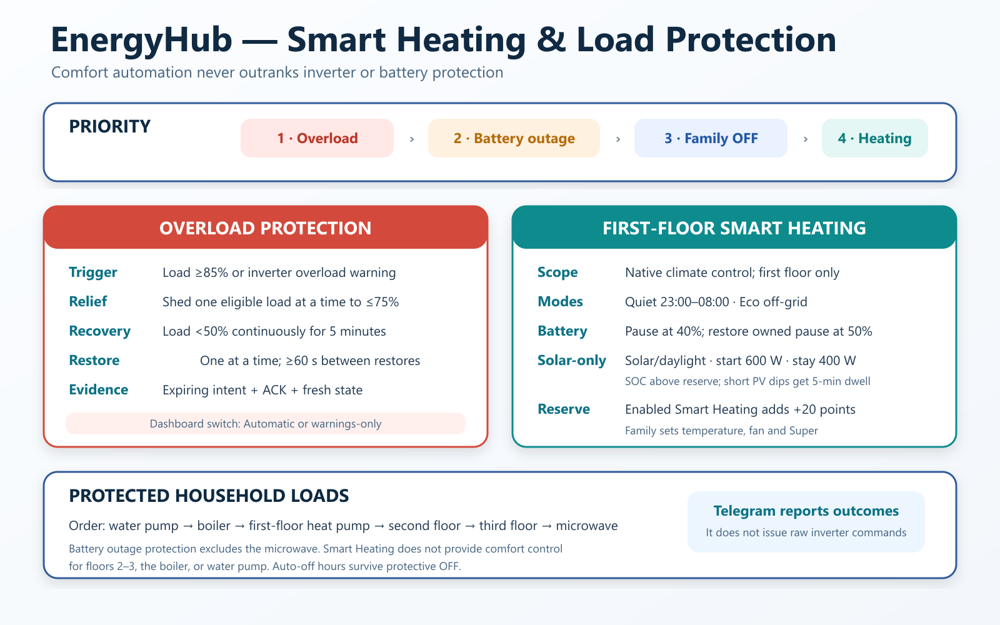

# EnergyHub Developer Architecture

Current 2.4 execution and ownership are summarized in
[System Architecture](05-System-Architecture.md) and
[Battery Reserve](BATTERY_RESERVE_CURRENT.md). Retained Hybrid/Panic code names
and MQTT identifiers do not imply separate night/day policy authorities.

## 2.1.3 presentation boundary

Display adapters translate friendly names and prose, never raw modes, MQTT keys
or persistence. Family current-strategy reporting is a read-only addition to
report generation, not a scheduler/control change. See
[display contract](../../RELEASE_NOTES_2.1.3.md).

## Historical 2.1.2 observer boundary

The separate baseline helper is removed. `advice_only` marks family ownership;
manual changes did not rebase the fixed 20% diagnostic calculation. That release
had no automatic control path; current 2.4 authority supersedes it. See the
[historical contract](../../RELEASE_NOTES_2.1.2.md).

## Purpose

This document maps the current implementation to runtime responsibilities. It is intended for developers who need to modify, test, or reconstruct EnergyHub.



## Runtime entry point

`addon/app/main.py` constructs all services and owns the process lifecycle.

Main responsibilities:

- load add-on options;
- construct adapter, services, and publishers;
- configure MQTT callbacks;
- publish Discovery and initial state;
- maintain the one-item mode request queue;
- run the telemetry loop;
- schedule QPIWS/QPIRI reads;
- trigger decisions;
- monitor target SOCs;
- reconcile day finalizations;
- publish confirmed events.

## Package map

```text
app/
  adapters/
    powmr.py
  models/
    inverter_state.py
  mqtt/
    publisher.py
  services/
    autopilot.py
    battery_health.py
    daily_summary.py
    event_bus.py
    grid_history.py
    grid_import.py
    grid_monitor.py
    grid_stability.py
    health_monitor.py
    battery_load_policy.py
    inverter_controller.py
    inverter_health.py
    peak_load_control.py
    panic_decision.py
    weather_buffer.py
    pv2_telemetry.py
    system_health.py
    telemetry.py
    telemetry_freshness.py
    watchdog.py
  utils/
    json_store.py
    logger.py
  config.py
  main.py
```

## Adapter

### `PowMrLocalAdapter`

Builds commands as:

```text
mpp-solar -p <serial> -P <protocol> -c <command> -o json
```

Properties:

- 25-second subprocess timeout;
- JSON output;
- one `threading.Lock` shared by PI30MAX command execution and direct Modbus;
- one fixed read-only Modbus operation for slave 5, function 03, registers
  4563-4564 at 2400 baud/8N1;
- strict response address, function, byte-count, CRC, byte-order, and range
  validation;
- adapter methods return protocol-level data or ACK booleans.

## Normalized state

`InverterState` contains:

- `valid`;
- `grid_available`;
- battery SOC, voltage, current;
- PV power;
- load power;
- raw telemetry.

Control grid availability is derived from AC input voltage greater than 180 V
in normalized telemetry. Dashboard voltage presentation is not a substitute
for that control gate or for historical Grid Confidence.

## MQTT threading and queue

Paho invokes MQTT callbacks in its network thread. The main loop consumes mode requests.

The queue:

- has `maxsize=1`;
- is protected by `mode_request_lock` during read/replace/write;
- stores `mode` and optional notification context;
- gives `safe_solar` priority.

This is not a general work queue. It represents the latest allowed strategy request, except that a pending safety recovery is preserved.

## MQTT input topics

Prefix:

```text
energyhub/input/ha/#
```

Current inputs:

| Suffix | Retained | Purpose |
|---|---:|---|
| `autopilot` | yes | master permission state |
| `inverter_mode` | no | `evaluate_hybrid`, `solar`, `panic` and supported requests |
| `solar_forecast_today_live` | yes | live contextual forecast |
| `solar_forecast_tomorrow_live` | yes | legacy contextual forecast input; not a current reserve decision reader |
| `daily_house_consumption` | yes | scheduled consumption input |
| `solar_forecast_today` | yes | scheduled Daily Summary input |
| `solar_forecast_tomorrow` | yes | scheduled/fallback forecast input |
| `daily_solar_surplus_estimated` | yes | scheduled Daily Summary input |
| `daily_summary_snapshot` | yes | atomic JSON historical snapshot |

## Runtime cadence

| Task | Cadence |
|---|---|
| QPIGS telemetry | configured, default 10 seconds |
| optional PV2 Modbus | configured, default 30 seconds; bounded failure backoff |
| QPIWS warnings | 60 seconds |
| QPIRI settings | 60 seconds |
| continuous reserve evaluation | 5 minutes, plus grid/mode reevaluation events |
| raw telemetry disk snapshot | at most 60 seconds |
| incremental Grid Import save | at most 60 seconds |
| preliminary next-day reserve forecast | HA trigger at 23:52 |
| Daily Summary atomic snapshot | HA trigger at 23:51 |
| current-day reserve forecast revision | HA trigger at 05:00 |

## Startup sequence

1. Load options.
2. Load persisted Inverter Controller, Grid History, Grid Import, and Daily Summary state.
3. Connect MQTT.
4. Publish Discovery.
5. Subscribe to HA input prefix.
6. Publish EnergyHub process online and inverter telemetry offline.
7. Receive retained Autopilot and forecast inputs.
8. Read QPIGS.
9. Read QPIRI.
10. Reconstruct strategy.
11. Accept consistent state without writes, or queue one safe Solar recovery if Autopilot is enabled and reconstruction is incomplete. An unfinished persisted hardware transition instead requires attended verification; automatic recovery is suspended.

Startup recovery waits for both:

- QPIRI reconstruction completion;
- retained Autopilot state reception.

## Telemetry path

`TelemetryService.create_state()` validates required data and converts values.

A valid sample:

- publishes all configured raw sensors;
- publishes `powmr/status=online`;
- updates the raw snapshot;
- feeds health, history, import, decisions, and event bus.

An invalid sample:

- increments Communication Watchdog errors;
- publishes raw inverter availability offline;
- leaves EnergyHub diagnostics available.

After a valid PI30MAX sample, `PV2TelemetryService` may schedule one serialized
PV2 read. Successful samples publish PV2 and an aligned Total PV. Failures are
caught inside the service, marked stale, and backed off without entering the
PI30MAX watchdog failure path. An unsupported-register exception suppresses
further Modbus attempts until process restart. Retained PV2 measurements are
masked by dedicated availability after failure, expiry, or restart.

## Health services

### Communication Watchdog

States:

- starting;
- online;
- recovering;
- stale;
- offline.

### Battery Health

Current rules:

- missing/invalid SOC → warning;
- SOC below 15% → warning;
- absolute SOC jump of at least 2 percentage points while both readings are at or below 95% → warning.

This is a warning service, not yet a complete telemetry quarantine layer.

### SOC Anomaly Journal

`SocAnomalyJournal` compares consecutive valid SOC samples and records an
event when the absolute change is at least five percentage points within five
minutes. Its `/data/soc_anomaly_journal.json` file retains the latest 100
events plus a lifetime count and the latest valid baseline. Each event carries
battery voltage and charge/discharge current, PV1/fresh PV2/aligned Total PV,
load, grid availability and voltage, mode, freshness, process uptime, SOC
region, and startup/communication-recovery flags.

The journal publishes only `sensor.energyhub_soc_anomaly_event_count` and
`sensor.energyhub_soc_anomaly_latest` diagnostics. It is not consulted by the
telemetry parser, controller, Hybrid/Panic services, smart-load policy, System
Health, or Telegram delivery. Load/save failures are logged and isolated.

### Telemetry Freshness

- no valid telemetry → stale;
- last valid telemetry age at least 60 seconds → stale;
- otherwise fresh.

Unchanged load duration is published separately.

### Inverter Health

QPIWS values equal to `1` are treated as active warnings, excluding command metadata and reserved fields.

The adapter normally returns a named QPIWS map. Metadata-only and malformed
bit replies cannot clear a fault. There is still no independently verified
complete-map marker; a valid-looking partial map remains an evidence gap.
Unlike the earlier diagnostic-only design, a recently verified active overload
warning may trigger the load controller. Failed reads cannot keep that control
signal current indefinitely.

EnergyHub 1.3.10 treats each change of the active named QPIWS set as a
diagnostic transition. It persists at most 100 incidents, closes an incident
when the active set changes or clears, and attaches a 30-sample/five-minute
in-memory pre-event telemetry ring. Current and latest-three MQTT entities are
retained for Home Assistant and the Family Assistant. QPIWS clearance alone is
not evidence of an inverter restart.

### System Health

- communication offline/unavailable → unavailable;
- starting/recovering/stale or any component warning → warning;
- otherwise normal.

## Inverter Controller

### Constants

- write attempts: 3;
- retry delay: 1 second;
- settle delay: 2 seconds;
- controller state schema: 3 (older supported schemas migrate on load).

### Menu 01

`set_output_priority()`:

1. sends POP command;
2. requires ACK;
3. reads QPIRI up to the configured verification attempts;
4. compares raw `output_source_priority` with the expected value;
5. returns success only after a match.

### Menu 16

`set_charger_priority()`:

1. durably records a transition-pending marker before the write;
2. sends PCP command and requires ACK;
3. stores and persists `known_charger_priority` immediately;
4. reports failure if that save fails, even after ACK.

There is no independent read-back. Menu 01 writes use the same pre-write marker;
it is cleared only when the complete confirmed mode is durably saved. Restart
with the marker still set refuses automatic mode reconstruction. A state-save
failure latches further hardware writes off for the rest of that process.

### Strategy transitions

#### Solar

Write OSO, then SBU. Confirm only when both succeed.

#### Hybrid Charging

Write/verify SUB, then ACK-confirm SNU. On partial failure, attempt Solar recovery.

#### Hybrid Grid Hold

Keep/verify SUB, then ACK-confirm OSO. On either failure, attempt one Solar recovery and preserve combined failure detail if recovery fails.

#### Panic

Persist target, write/verify SUB, ACK-confirm SNU. On partial failure, attempt Solar recovery.

#### Panic Grid Hold

Preserve the Panic target/context, keep/verify SUB, and ACK-confirm OSO. Resume Panic Charging if SOC falls below target.

## Continuous reserve evaluation

`PanicDecisionEngine` evaluates the applied reserve throughout the day;
see [Decision Engine](DECISION_ENGINE.md). With fresh telemetry and grid
available, SOC below reserve requests charging and SOC at reserve requests
grid hold. Solar resumes at reserve +10 points; the 95% cap remains held until
reserve decreases. With grid unavailable the controller waits, rather than
claiming grid charging. The retained controller modes and old identifier names
are compatibility details, not a 23:50/07:00 ownership handoff.

## Notifications

Decision context is attached to the queued request. After transition processing:

- success → event type `automatic_mode_activation`;
- failure → event type `automatic_mode_activation_failed`, including current mode and error.

No activation event is published at decision time.

## Persistence internals

`atomic_write_json()` creates a temporary file beside the target, flushes and fsyncs it, replaces the target atomically, then fsyncs the directory where supported.

This reduces corruption risk after sudden power loss.

## Daily Summary internals

The service accepts individual numeric inputs but does not snapshot on them.

The atomic JSON snapshot requires:

- current date;
- source timestamp;
- daily house consumption;
- forecast today;
- estimated solar surplus.

A duplicate source timestamp is idempotently accepted.

## Grid Import internals

Schema version: 2.

Tracked fields:

- house energy;
- battery energy;
- current power;
- yesterday total;
- SUB interval start/max SOC;
- already-accounted battery contribution;
- pending day finalizations.

An invalid finalization remains queued for retry. An `updated` or `unchanged`
result is acknowledged normally. A `missing` Daily Summary snapshot is also
acknowledged and removed from the queue because the scheduled historical
snapshot cannot appear later; the completed value remains available in Grid
Import history and the log records the missing reconciliation. This is a
deliberate bounded-retry policy, not loss of the underlying Grid Import total.

Intervals longer than 60 seconds are not integrated as house energy, preventing a long blocked loop from creating a false jump.

## Entity stability

MQTT Discovery includes:

- stable `unique_id`;
- explicit `default_entity_id` for fresh HA installations;
- process or combined availability as appropriate.

Existing HA registry IDs are not automatically renamed by `default_entity_id`; migrations must preserve unique ID and rename through Home Assistant.

## Acknowledged load protection

`PeakLoadGuardController` owns the current overload and outage-discharge load
protection state. It consumes fresh inverter load telemetry plus the schema-5
Home Assistant participant snapshot, publishes short-lived allow-listed intents,
and requires acknowledgement followed by fresh state/context and power evidence.
Confirmed ownership is persisted in `/data/energyhub_peak_load_control.json`.
The historical 40/30/20 observer and its separate journal are removed.
If a bounded service-intent queue evicts evidence for a pending or owned load,
that load is quarantined or released from ownership. Other loads remain eligible.

## Battery Reserve policy

`WeatherBufferDryRun` retains its historical name and MQTT entity for upgrade
compatibility, but now owns the complete Manual/Automatic Battery Reserve
policy. At 23:52 Home Assistant publishes tomorrow's Solcast forecast for a
preliminary next-day plan, after the 23:51 completed Daily Summary. At 05:00 it
publishes an updated current-day forecast that replaces the preliminary
forecast component. `DailySummaryService` supplies up to three newest valid
positive completed consumption days.

The recommendation is `20% policy base + forecast + grid + weather + Smart Heating`, capped at 95%.
Forecast deficit contributes 20 points. Grid Confidence contributes
0/20/40/60 points for Normal/Unstable/Risk/Panic. Weather contributes 20 points
only for active Level II–III, infrastructure-relevant, Kyiv/Kyiv-region UHMC
warnings while confidence is Normal. The forecast component never accumulates;
missing morning forecast retains the preliminary component. Grid and weather
components remain live. Enabled Smart Heating contributes 20 points. Manual
recommends only; Automatic applies a complete,
fresh recommendation through the guarded Home Assistant helper automation.

Telegram Family Assistant parses the public `uhmc1921` preview and publishes a
normalized retained document to `energyhub/input/weather/uhmc` through Home
Assistant's authenticated MQTT service. It persists active warnings so preview
pagination and restart do not clear them, handles duplicates, updates,
cancellations and expiry, and publishes source status `unknown` on read
failure. EnergyHub preserves the last warning set while status is unknown.

The decision remains stored in `/data/energyhub_weather_buffer.json` and
exposed as `sensor.energyhub_ahm_weather_buffer`. Family Assistant reads it for
daytime warning explanations and the matching 08:00 report. Existing entity,
MQTT and persistence identifiers remain unchanged for compatibility.

## Known technical debt

- `main.py` is large;
- release test coverage remains concentrated in standard-library unit suites;
- dependencies are unpinned;
- graceful shutdown is implicit;
- constants are duplicated across services;
- Grid Import is approximate during daytime SUB with simultaneous PV;
- some policy thresholds and device roles still need per-installation review.

## Safe refactoring order

1. Add pure service tests.
2. Add controller tests with a fake adapter.
3. Add queue/notification integration tests.
4. Extract lifecycle coordinators one responsibility at a time.
5. Preserve MQTT contracts and persisted schemas.
