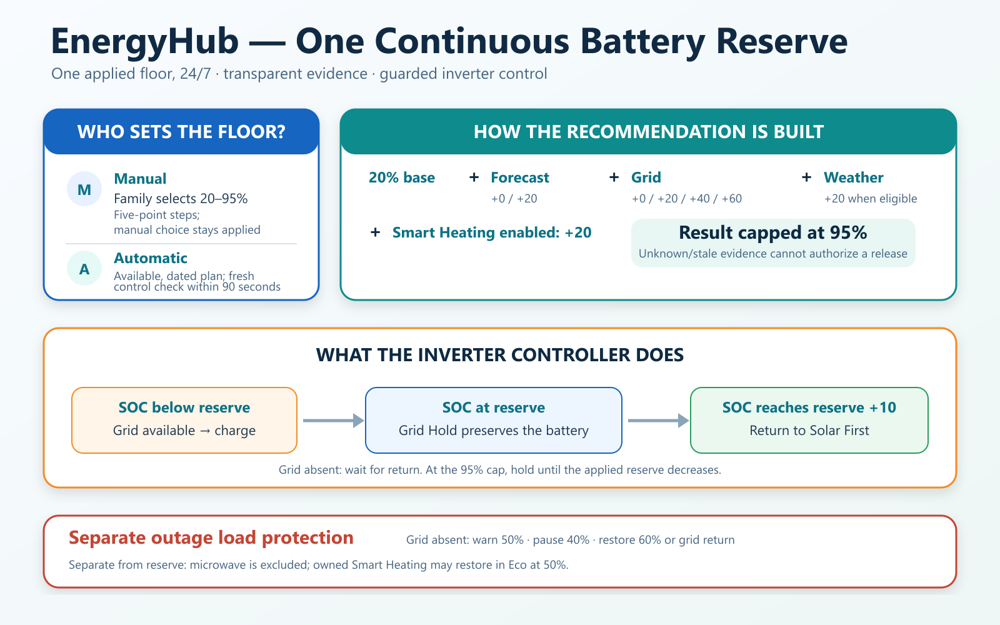

# Battery Reserve — current operating contract



Battery Reserve is one applied value from 20% to 95% in five-point steps. It is
the sole inverter reserve target, 24 hours a day.

## Recommendation and authority

```text
recommended = min(95%, 20% base + forecast + grid + weather + smart heating)
```

- Forecast contributes 0 or 20 points by comparing forecast generation
  with the newest one-to-three valid completed consumption days.
- Grid Confidence contributes 0/20/40/60 points for
  Normal/Unstable/Risk/Critical.
- A relevant fresh UHMC Level II/III warning contributes 20 points for every
  known Grid Confidence state. Weather and grid risk are independent inputs;
  their additive result remains capped at 95%.
- Enabled Smart Heating contributes 20 points.
- Explicitly unknown or stale grid/weather evidence cannot authorize lowering
  a prior conservative allowance. The origin-age of the Solcast forecast is
  not independently proved by the current control reevaluation timestamp.

Manual authority preserves the family's selected value and recommends only.
Automatic authority applies only a complete, recently reevaluated
recommendation through the guarded Home Assistant automation. The application
checks current entity availability, the plan date/window and a control
reevaluation timestamp no older than 90 seconds. This timestamp does not
prove when Solcast last updated its source forecast. A retained MQTT
recommendation alone cannot authorize a reserve change.

The 23:52 preliminary next-day forecast and 05:00 current-day revision update
only forecast evidence. They do not create a separate night target or ownership
handoff. Grid, weather, and Smart Heating evidence can update during the day.

## Inverter behavior

With valid telemetry and available grid:

- SOC below Battery Reserve requests Battery Reserve Charging;
- SOC at the reserve requests Battery Reserve Grid Hold;
- SOC reaching reserve +10 points returns to Solar First;
- a 95% reserve remains held until the applied reserve decreases.

If the grid is absent at or below the floor, EnergyHub remains armed and waits;
it does not claim grid charging or Grid Hold without physical grid availability.
Autopilot OFF returns automatic strategy ownership safely to Solar First.

Internal `panic` and legacy `hybrid_*` identifiers remain only where required
for MQTT/entity continuity, confirmed inverter transitions, or safe restart
migration. They are not separate current reserve policies.

## Load protection is separate


Battery-discharge protection uses actual grid presence, not Grid Confidence or
the applied reserve:

- warn once at 50% SOC during an outage;
- stop flexible participating loads at 40%;
- restore at 60% or after verified grid recovery;
- allow the first-floor Smart Heating load to restore in Eco at 50% only when
  EnergyHub owns that pause;
- never disconnect the microwave for battery protection.

Overload protection is another independent owner. It triggers at 85% load or a
recent, valid inverter overload warning, sheds one eligible load at a time toward 75%, and
restores after load remains below 50% for five minutes. Every command is
allow-listed, expiring, acknowledged, and confirmed from fresh state and power
evidence. A fresh contradictory power sample vetoes confirmation; unchanged
older power alone need not veto a confirmed state/context transition. Manual
intervention releases EnergyHub ownership.

Protective control priority is overload protection, then battery-discharge
protection. A family OFF request overrides optional Smart Heating starts.

## Smart Heating boundary

Smart Heating controls only `climate.first_floor_heat_pump`. The physical
smart plug stays ON for routine climate operation and power measurement;
protective isolation and guarded restart restoration are separate controls.
Smart Heating does not use the plug for normal cycling or set the family's
temperature, fan speed, or Super selection.

- Normal by day;
- Quiet from 23:00 through 08:00;
- Eco while operating without grid;
- pause at 40% SOC and restore only its owned pause at 50%;
- optional Solar-only operation requires Solar strategy, daylight, at least
  600 W Total PV to start (400 W to continue), and SOC above the applied
  Battery Reserve. Short PV fluctuations are subject to a five-minute climate
  state dwell; the 40% battery safety stop is immediate.

The first-floor climate starts only after Smart Heating is explicitly enabled
or when EnergyHub owns a battery/solar pause. A later family HA OFF request
holds it in manual OFF until Smart Heating is switched OFF and ON again.
The temporary auto-resume flag is also cleared after confirmed Heat, so a
later remote OFF is not automatically reversed. An OFF during an already-owned
pause may still be ambiguous; switch Smart Heating OFF for explicit manual
authority in that case.
After HA restart, plug restoration is separate: current load/guard/grid
evidence, five minutes of grid recovery, one plug per attempt, and five
minutes between attempts are required.

Second- and third-floor heat pumps, the boiler, and the water pump remain family
or timer controlled except when higher-priority overload or outage protection
owns a confirmed action.

## Implementation references

- [Battery Reserve recommendation](../../addon/app/services/weather_buffer.py)
- [Continuous inverter reserve controller](../../addon/app/services/panic_decision.py)
- [Acknowledged load controller](../../addon/app/services/peak_load_control.py)
- [Outage-discharge policy](../../addon/app/services/battery_load_policy.py)
- [Home Assistant control bridge and Smart Heating](../../homeassistant/live/config/automations.yaml)
- [Overload-control design](PEAK_LOAD_CONTROL.md)
- [Smart Heating design](SMART_HEATING_2.4.md)
